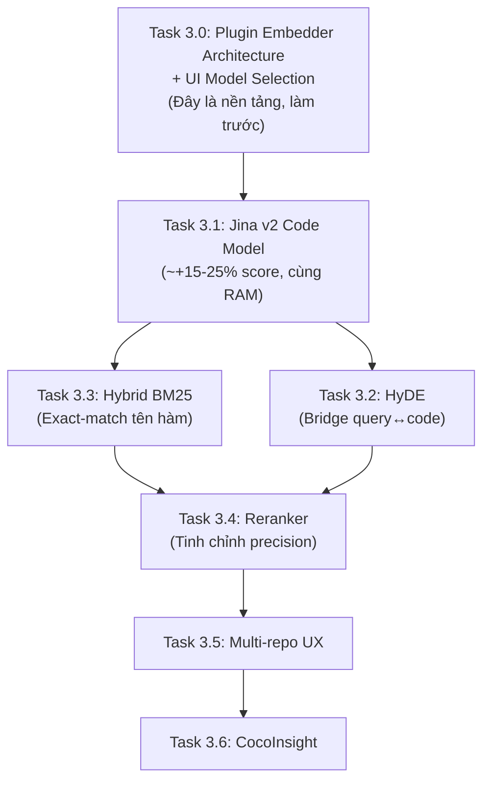

# Phân Tích Hiện Trạng & Kế Hoạch Phase 3

> **Cập nhật 2026-05-19:** Đã cập nhật Task 3.1 với model phù hợp local hơn (`jina-embeddings-v2-base-code`), thêm Task 3.0 về kiến trúc embedding linh hoạt hỗ trợ đa loại tài liệu và UI model selection.

---

## Phần 1: Hiện Trạng — Ứng Dụng Đã Đáp Ứng Được Gì?

### ✅ Thành tựu đã hoàn thành (Foundation vững chắc)

| Hạng mục | Trạng thái | Chi tiết |
|----------|-----------|----------|
| **AST-based Chunking** | ✅ Hoàn thành | `ast_chunker.py` dùng Tree-sitter thực sự, phân tách ngữ nghĩa theo function/class thay vì cắt theo ký tự |
| **Multi-language Support** | ✅ Hoàn thành | Python, C#, JavaScript, TypeScript, TSX, HTML, CSS/SCSS/LESS |
| **Rich Metadata** | ✅ Hoàn thành | `node_type`, `node_name`, `start_line`, `end_line`, `is_test`, `puid`, `parent_puid`, `is_skeleton` |
| **Skeleton Index** | ✅ Hoàn thành | Mỗi class/file tạo thêm 1 node "Mục lục" (signatures) — tiền đề cho Two-stage RAG |
| **PUID Graph (Mini)** | ✅ Hoàn thành | `puid` và `parent_puid` lưu quan hệ cha-con, dùng được để Context Enrichment |
| **Embedding Model tốt** | ✅ Hoàn thành | `all-mpnet-base-v2` (NDCG@10: 57.0 vs MiniLM: 49.2) |
| **3-Layer Retrieval** | ✅ Hoàn thành | Query Expansion → Over-fetch + Threshold → Context Enrichment qua PUID |
| **Decorator/Export capture** | ✅ Hoàn thành | Angular `@Component`, `export const fn = () => {}` được capture |
| **Multi-source indexing** | ✅ Hoàn thành | `sources.json` lưu nhiều path, filter theo `source_filters` trong SQL |
| **Universal Fallback** | ✅ Hoàn thành | File ngôn ngữ khác dùng `RecursiveSplitter` của CocoIndex |
| **Incremental update** | ✅ Hoàn thành | CocoIndex `memo=True` chỉ re-index file thay đổi |
| **Enriched text prefix** | ✅ Hoàn thành | `"File: X\nType: Y\nName: Z\n\n{code}"` → embedding mang ngữ cảnh tốt hơn |

### ⚠️ Còn thiếu — Tiền đề cho Phase 3

| Hạng mục | Trạng thái | Tác động |
|----------|-----------|---------|
| **Hybrid Search (BM25 + Vector)** | ❌ Chưa có | Miss exact-match tên hàm/class cụ thể |
| **Cross-Encoder Reranker** | ❌ Chưa có | Thứ tự top-K chưa tối ưu nhất |
| **HyDE (Hypothetical Doc Embedding)** | ❌ Chưa có | Query ngắn/mơ hồ chưa được "bridge" sang không gian code |
| **Code-specific Embedding Model** | ❌ Chưa dùng | `all-mpnet-base-v2` là general, chưa chuyên cho code |
| **Code Graph thực thụ (Call Graph)** | ❌ Chưa có | Chưa biết hàm A gọi hàm B → chưa Graph-augmented RAG |
| **Full-text Search Index (tsvector)** | ❌ Chưa có | Tìm tên cụ thể kém hơn BM25 |
| **CocoInsight UI** | ❌ Chưa có | Không thể quan sát pipeline indexing trực quan |

---

## Phần 2: Phân Tích Điểm Số (Score 0.3–0.4)

### 2.1 Điểm này có lý tưởng không?

**Không lý tưởng.** Đây là mức **thấp-trung bình** cho RAG production.

| Dải điểm | Ý nghĩa với `all-mpnet-base-v2` |
|----------|-------------------------------|
| `> 0.7` | Rất cao — gần như paraphrase |
| `0.5–0.7` | Tốt — liên quan rõ ràng về ngữ nghĩa |
| `0.4–0.5` | Chấp nhận được — có liên quan nhưng chưa chắc |
| `0.3–0.4` | **Yếu** — chỉ chia sẻ chủ đề chung, thiếu ngữ nghĩa cụ thể |
| `< 0.3` | Không liên quan |

**Đặc biệt với code search:** `all-mpnet-base-v2` được train chủ yếu trên văn bản tự nhiên. Khi embedding code (cú pháp đặc biệt, tên biến kỹ thuật), khoảng cách ngữ nghĩa với câu hỏi tiếng Việt/Anh tự nhiên thường bị **kéo xa**, làm điểm thấp hơn so với mức lý tưởng.

### 2.2 Nguyên nhân cụ thể gây điểm thấp

#### Nguyên nhân 1: Mismatch giữa query và code (quan trọng nhất)
- **Query:** Viết bằng ngôn ngữ tự nhiên ("hàm thêm tài sản")
- **Embedding trong DB:** Là code ("AddAsync method với logic C#...")  
- Khoảng cách semantic giữa ngôn ngữ tự nhiên và cú pháp code là vốn dĩ lớn với general embedding model.

#### Nguyên nhân 2: `all-mpnet-base-v2` không chuyên cho code
- Model này train trên Wikipedia, BookCorpus, news — **không có code**.
- Khi gặp `async Task<IResult> AddAsync(CreateAssetDto dto)`, model "hiểu" nó kém hơn nhiều so với văn xuôi.
- Các model chuyên code (`nomic-embed-code`, `voyage-code-3`, `jina-embeddings-v2-base-code`) có thể nâng điểm lên 0.55–0.75 cho cùng query.

#### Nguyên nhân 3: Enriched text prefix có thể gây "noise"
- Hiện tại mỗi chunk được prefix: `"File: X\nType: Y\nName: Z\n\n{code}"`
- Khi embed, prefix này chiếm token và "pha loãng" vector, đặc biệt với chunk nhỏ (short functions).

#### Nguyên nhân 4: Query chưa được "dịch" sang không gian code
- Query Expansion hiện tại chỉ tạo biến thể ngôn ngữ, không generate ra code mẫu.
- **HyDE** (Hypothetical Document Embeddings) sẽ cho LLM tạo ra đoạn code giả để search — vector của code giả gần với code thật hơn nhiều so với câu hỏi tự nhiên.

#### Nguyên nhân 5: Không có Reranking
- Top-K vector search sắp xếp theo cosine similarity của embedding — không phải độ hữu ích thực sự.
- Cross-Encoder reranker nhìn vào cả query + document cùng lúc, đánh giá relevance chính xác hơn.

### 2.3 Điểm số cao hơn có nghĩa là RAG tốt hơn không?

**Không nhất thiết.** Điểm cosine similarity chỉ đo *geometric proximity*, không đo *utility*. Quan trọng hơn là chất lượng câu trả lời cuối cùng. Tuy nhiên với code search, điểm thấp là dấu hiệu retrieval chưa tốt và có thể cải thiện được.

### 2.4 Giải pháp cải thiện — Cập nhật cho Phase 3

Các giải pháp sau được **thêm vào Phase 3** (xem chi tiết ở Phần 3):

1. **Chuyển sang embedding model code-specific** → Nâng điểm cơ bản +15–25%
2. **HyDE** → Bridge semantic gap query↔code
3. **Hybrid Search BM25+Vector** → Bắt được exact-match tên hàm
4. **Cross-Encoder Reranker** → Cải thiện thứ tự kết quả

---

## Phần 3: Kế Hoạch Chi Tiết Phase 3

### Mục tiêu Phase 3
> Nâng cấp **chất lượng retrieval** từ "tìm đúng chủ đề" lên "tìm đúng và có context sâu", đồng thời mở rộng sang **multi-repository thực thụ** với unified search.

---

### Task 3.0: Kiến Trúc Embedding Linh Hoạt — Plugin-Based & Multi-Source

> [!IMPORTANT]
> Task này là **nền tảng kiến trúc** phải hoàn thành trước tất cả các task còn lại của Phase 3.

#### Có nên dùng nhiều Embedding Model trong 1 app RAG không?

**Có thể — nhưng phải theo nguyên tắc bất di bất dịch:**

> **Model dùng để INDEX và model dùng để QUERY phải luôn giống nhau.**  
> Trộn model khác nhau tạo ra vector space không tương thích — kết quả search vô nghĩa.

| Kịch bản | An toàn? | Lý do |
|----------|---------|-------|
| 1 model code + 1 model doc — mỗi loại có **bảng PG riêng** | ✅ Tốt | Vector space tách biệt hoàn toàn |
| User chọn model → search trên data đã index bởi model khác | ❌ Sai | Vector space mismatch → rác |
| User chọn model → **re-index toàn bộ** → search | ✅ Đúng | Đồng nhất model index=query |
| Dense vector + BM25 sparse | ✅ Best practice | BM25 không phụ thuộc model |

#### Kiến Trúc Đề Xuất — Plugin-Based EmbedderProfile

```
┌───────────────────────────────────────────┐
│            EmbedderRegistry             │
│  ┌──────────────┐   ┌─────────────┐   │
│  │ "code" profile│   │"doc" profile│   │
│  │ jina-v2-code  │   │ all-mpnet    │   │
│  │ [py,ts,cs,js] │   │[md,txt,docx] │   │
│  └──────────────┘   └─────────────┘   │
└───────────────────────────────────────────┘
        │                   │
   ┌─────┴─────┐        ┌───┴──────┐
   │code_embeddings│        │doc_embeddings│
   │  (PG table)   │        │  (PG table)  │
   └───────────────┘        └──────────────┘
```

**Nguyên tắc:** Mỗi profile → 1 bảng PostgreSQL riêng. File được route đến profile dựa trên extension. Khi đổi model: chỉ re-index bảng đó, không ảnh hưởng profile khác.

#### Cấu Trúc `embedder_config.py` (file mới)

```python
from dataclasses import dataclass, field
from typing import List, Dict

@dataclass
class EmbedderProfile:
    name: str            # "code", "doc"
    display_name: str    # Hiển thị trên UI
    model_id: str        # HuggingFace model ID
    table_name: str      # Bảng PG tương ứng
    source_extensions: List[str]
    description: str = ""
    max_tokens: int = 384

DEFAULT_PROFILES: Dict[str, EmbedderProfile] = {
    "code": EmbedderProfile(
        name="code",
        display_name="Code — Jina v2 (Chuyên code, 8192 tok)",
        model_id="jinaai/jina-embeddings-v2-base-code",
        table_name="code_embeddings",
        source_extensions=["py","ts","tsx","js","cs","html","css","scss","less"],
        max_tokens=8192,
    ),
    "general": EmbedderProfile(
        name="general",
        display_name="General — all-mpnet (Đa năng, nhẹ)",
        model_id="sentence-transformers/all-mpnet-base-v2",
        table_name="code_embeddings",
        source_extensions=["py","ts","tsx","js","cs","html","css","scss","less"],
        max_tokens=384,
    ),
    # Phát triển trong Phase 4:
    # "doc": EmbedderProfile(
    #     name="doc",
    #     display_name="Document (Đa năng, Word/Excel/PDF)",
    #     model_id="sentence-transformers/all-mpnet-base-v2",
    #     table_name="doc_embeddings",
    #     source_extensions=["md","txt","docx","xlsx","pdf"],
    # ),
}
```

#### Roadmap mở rộng sang tài liệu (Phase 4+)

| Loại tài liệu | Extension | Chunking strategy | Ghi chú |
|--------------|-----------|-------------------|---------|
| Markdown | `.md` | Split theo heading `#`/`##` | Đơn giản, Phase 4 |
| Plain text | `.txt` | Paragraph split | Đơn giản |
| Word | `.docx` | Heading + paragraph | Cần `python-docx` |
| Excel | `.xlsx` | Sheet + table row chunking | Cần `openpyxl` |
| PDF | `.pdf` | Page + paragraph | Cần `pypdf` |

> [!NOTE]
> Phase 3 chỉ chuẩn bị **kiến trúc** (EmbedderProfile + bảng doc_embeddings comment sẵn). Thực thi doc chunker là việc của Phase 4.

#### UI Model Selection

**Luồng khi user đổi model:**
```
User chọn model mới → Cảnh báo: "Đổi model yêu cầu Re-index. Tiếp tục?"
    → Xác nhận → Lưu vào session → app.drop() + app.update() → Search dùng model mới
```

**Việc cần làm:**
- [ ] Tạo `embedder_config.py` với `EmbedderProfile` và `DEFAULT_PROFILES`
- [ ] Sửa `indexer_flow.py`: `EMBED_MODEL` và `TABLE_NAME` lấy từ profile active
- [ ] Thêm selectbox "Embedding Model" vào Sidebar trong `app.py`:
  - Hiển thị `display_name` + `description`
  - Khi thay đổi: hiện `st.warning` + nút "Xác nhận đổi model & Re-index"
- [ ] Lưu lựa chọn vào file config (persist qua restart)
- [ ] Log: in ra profile đang active mỗi khi khởi động

**Files cần tạo/sửa:** `embedder_config.py` (mới), `indexer_flow.py`, `app.py`

---

### Task 3.1: Nâng Cấp Embedding Model — Jina v2 Code

**Mục tiêu:** Thay `all-mpnet-base-v2` bằng model chuyên cho code, **phù hợp chạy local**.

| Model | Params | RAM | Context | Chuyên code? |
|-------|--------|-----|---------|-------------|
| `all-mpnet-base-v2` (hiện tại) | 109M | ~210MB | 384 tok | ❌ General |
| **`jina-embeddings-v2-base-code`** ✅ | 161M | ~280MB | **8192 tok** | ✅ Code |
| `nomic-embed-code` ❌ (bỏ) | **7B** | **4–8GB** | — | ✅ Code |

> **Lý do bỏ `nomic-embed-code`:** 7B tham số, cần 4–8GB RAM chỉ riêng model — quá nặng cho local CPU.  
> `jina-v2-base-code` chỉ 161M params, RAM tương đương hiện tại, context window 8192 tokens, train trên 30 ngôn ngữ lập trình.

**Lợi ích thực tế:**
- 8192 tok context → embed được cả class lớn mà không bị truncate
- Chuyên code → hiểu cú pháp kỹ thuật tốt hơn all-mpnet
- **Cùng 768 dims** → không cần đổi schema PostgreSQL

**Việc cần làm (sau khi hoàn thành Task 3.0):**
- [ ] Thêm `"code"` là default profile trong `embedder_config.py`
- [ ] Test load model trong Docker — đo thời gian embed 1 file điển hình
- [ ] Nếu latency < 3s/file: đặt làm default; nếu không: giữ `general` làm default
- [ ] **Bắt buộc Reset & Re-index** sau khi đổi
- [ ] So sánh score trước/sau trên 10 câu hỏi mẫu

**Files cần sửa:** `embedder_config.py`, `indexer_flow.py`


---

### Task 3.2: HyDE — Hypothetical Document Embeddings

**Mục tiêu:** Thay vì embed câu hỏi tự nhiên, dùng LLM generate ra "đoạn code giả" rồi embed đoạn code đó để search.

**Pipeline HyDE:**
```
[User Query] 
    → LLM prompt: "Viết đoạn code Python/C# có thể trả lời: {query}"
    → [Hypothetical Code Snippet]
    → Embed code snippet này
    → Vector search với vector của code snippet
    → [Kết quả liên quan hơn]
```

**Việc cần làm:**
- [ ] Thêm hàm `generate_hypothetical_document(query, lang_hint, llm)` trong `rag.py`
  - Prompt: *"Write a short code snippet (function/class) that would answer: {query}. Use {lang} syntax."*
  - Output: raw code string (không giải thích)
- [ ] Tích hợp vào `query_cocoindex_db()`: thay vì embed query trực tiếp, embed hypothetical doc
- [ ] Giữ Query Expansion song song (chạy cả 2, merge kết quả, deduplicate theo PUID)
- [ ] Thêm toggle "HyDE" trong Sidebar (mặc định: bật)
- [ ] Log: in ra hypothetical document được generate để debug

**Lưu ý:** HyDE tốt nhất khi kết hợp với code-specific model (Task 3.1).

**Files cần sửa:** `rag.py`, `app.py`

---

### Task 3.3: Hybrid Search — Vector + Full-Text (BM25)

**Mục tiêu:** Bổ sung PostgreSQL Full-Text Search để bắt được exact-match tên hàm/class khi user hỏi chính xác.

**Vấn đề hiện tại:** User hỏi `"hàm AddAsync"` — vector search có thể trả về hàm khác vì embedding gần nhau. BM25 sẽ tìm chính xác chuỗi `AddAsync`.

**Kiến trúc Hybrid:**
```sql
-- Thêm cột tsvector vào bảng hiện tại
ALTER TABLE code_embeddings ADD COLUMN text_search tsvector 
  GENERATED ALWAYS AS (to_tsvector('english', COALESCE(node_name,'') || ' ' || COALESCE(text,''))) STORED;

-- Tạo GIN index
CREATE INDEX idx_text_search ON code_embeddings USING GIN(text_search);
```

**Reciprocal Rank Fusion (RRF) để merge kết quả:**
```python
def rrf_merge(vector_results, bm25_results, k=60):
    scores = {}
    for rank, r in enumerate(vector_results):
        scores[r['puid']] = scores.get(r['puid'], 0) + 1/(k + rank + 1)
    for rank, r in enumerate(bm25_results):
        scores[r['puid']] = scores.get(r['puid'], 0) + 1/(k + rank + 1)
    return sorted(scores.items(), key=lambda x: x[1], reverse=True)
```

**Việc cần làm:**
- [ ] Thêm cột `text_search tsvector` vào schema `CodeEmbedding` (migration)
- [ ] Thêm GIN index trong `app_main()` khi mount table
- [ ] Viết hàm `_fulltext_search_async(query, top_k)` trong `indexer_flow.py`
- [ ] Implement RRF merge trong `query_cocoindex_db()` của `rag.py`
- [ ] Thêm toggle "Hybrid Search" trong Sidebar (mặc định: bật)
- [ ] Log: in ra số kết quả từ vector, BM25, và sau merge

**Files cần sửa:** `indexer_flow.py`, `rag.py`, `app.py`

---

### Task 3.4: Cross-Encoder Reranker

**Mục tiêu:** Sau khi Over-fetch (top-K × 2), dùng Cross-Encoder để sắp xếp lại thứ tự chính xác hơn trước khi đưa vào LLM.

**Model đề xuất:** `cross-encoder/ms-marco-MiniLM-L-6-v2` (nhẹ, local) hoặc `BAAI/bge-reranker-v2-m3` (tốt hơn nhưng nặng hơn).

**Pipeline:**
```
Vector Search (top 20) + BM25 (top 20)
    → RRF Merge (top 20 unique)
    → Cross-Encoder Score mỗi (query, chunk) pair
    → Sort by reranker score
    → Top K final → LLM
```

**Việc cần làm:**
- [ ] Thêm `sentence-transformers` CrossEncoder vào `requirements.txt`
- [ ] Tạo `RERANKER` ContextKey trong `indexer_flow.py` (load 1 lần, giữ trong memory)
- [ ] Viết hàm `rerank(query, candidates)` trong `rag.py`
- [ ] Tích hợp sau bước Over-fetch + Threshold trong `query_cocoindex_db()`
- [ ] Thêm toggle "Reranking" trong Sidebar (mặc định: tắt — vì tăng latency ~2-3s)
- [ ] Log: so sánh thứ tự trước/sau reranking

**Lưu ý về latency:** Reranker chạy mỗi (query, chunk) pair — với 20 candidates × 1 model inference ≈ 2-4 giây thêm trên CPU.

**Files cần sửa:** `indexer_flow.py`, `rag.py`, `app.py`, `requirements.txt`

---

### Task 3.5: Multi-Repository Enhancement

**Mục tiêu:** Nâng cấp khả năng index và search đồng thời trên nhiều repo, cho phép cross-repo reasoning.

**Hiện trạng:** App đã hỗ trợ multi-source qua `sources.json`, nhưng:
- Mỗi source được index vào **cùng 1 bảng** → không có namespace tách biệt
- Filter SQL dùng `LIKE '/tmp/workspace/repo_hash/%'` → dễ nhầm nếu hash collision
- Không có metadata `repo_name` / `repo_path` rõ ràng

**Cải tiến:**
- [ ] Thêm cột `repo_name` (string ngắn gọn) vào `CodeEmbedding` dataclass
- [ ] Trong `process_file`, extract `repo_name` từ subdir name (trước `_hash`)
- [ ] Cập nhật filter SQL: `WHERE repo_name = ANY($3)` thay vì LIKE
- [ ] UI: hiển thị rõ kết quả đến từ repo nào trong Citations panel
- [ ] Thêm tùy chọn "Search across all repos" / "Search in selected repos"
- [ ] Trong Sidebar: hiển thị số chunk đã index theo từng repo

**Về CocoIndex multi-repo best practice:**  
CocoIndex hỗ trợ chạy nhiều `coco.App` instance hoặc dùng chung 1 App với multiple sources. Phương án hiện tại (1 App, multiple sources mount vào workspace) là phù hợp. Nâng cấp chủ yếu là về **metadata tagging** và **UI filtering**.

**Files cần sửa:** `indexer_flow.py`, `app.py`, `rag.py`

---

### Task 3.6: CocoInsight Integration

**Mục tiêu:** Bật tính năng monitoring của CocoIndex để quan sát pipeline indexing.

**Việc cần làm:**
- [ ] Nghiên cứu cách khởi động CocoInsight UI: `cocoindex server` hoặc `cocoindex run --address 0.0.0.0:8080`
- [ ] Thêm service `cocoinsight` vào `docker-compose.yml` expose port 8080
- [ ] Xác nhận version CocoIndex hiện tại có hỗ trợ CocoInsight chưa (check `cocoindex --version`)
- [ ] Nếu hỗ trợ: test thử truy cập `http://localhost:8080` để xem Flow graph

**Files cần sửa:** `docker-compose.yml`

---

### Thứ Tự Ưu Tiên Triển Khai



| Thứ tự | Task | Lý do | Dự kiến tác động |
|--------|------|--------|-----------------|
| 1 | **3.0** — Plugin Embedder + UI Select | Nền tảng kiến trúc | Extensibility |
| 2 | **3.1** — Jina v2 Code Model | Model code-specific, nhẹ | Score +15–25% |
| 3 | **3.3** — Hybrid BM25 | Bắt exact-match, ít code | Recall +20–30% |
| 4 | **3.2** — HyDE | Bridge query→code gap | Relevance +10–15% |
| 5 | **3.4** — Reranker | Tinh chỉnh top-K | Precision +10–20% |
| 6 | **3.5** — Multi-repo UX | Metadata `repo_name` | UX improvement |
| 7 | **3.6** — CocoInsight | Observability | Dev experience |

---

### Kế Hoạch Kiểm Tra (Verification)

#### Benchmark score trước/sau mỗi Task
Tạo 10 câu hỏi chuẩn đại diện 3 loại:
- **Type A (Exact):** "Hàm AddAsync trong AssetService làm gì?"
- **Type B (Semantic):** "Cách xử lý lỗi khi thêm tài sản"
- **Type C (Cross-repo):** "Luồng từ Angular form đến API endpoint"

Đo: `avg_score`, `top1_relevant%`, `LLM_answer_quality (1-5)`

| # | Kiểm tra | Kết quả mong đợi |
|---|---------|-----------------|
| 3.1.1 | So sánh điểm avg trước/sau đổi model | Score tăng ít nhất +0.1 trung bình |
| 3.2.1 | HyDE: hỏi "hàm xử lý authentication" | Tìm được đúng middleware/handler mà query gốc miss |
| 3.3.1 | BM25: hỏi chính xác "hàm AddAsync" | Rank #1 phải là `AddAsync`, không bị vector đè |
| 3.4.1 | Reranker ON vs OFF: cùng câu hỏi | Top-3 với reranker phải relevant hơn theo đánh giá thủ công |
| 3.5.1 | Select 1 repo, hỏi về class từ repo kia | Không xuất hiện kết quả từ repo không được chọn |

---

## Ghi Chú Kỹ Thuật

> [!IMPORTANT]
> **Bắt buộc Reset & Re-index sau Task 3.1:** Đổi embedding model làm thay đổi vector dimension. Toàn bộ data cũ phải được re-index.

> [!WARNING]
> **Reranker (Task 3.4) trên CPU:** Mỗi inference với 20 candidates tốn 2-4 giây. Nên để mặc định là OFF và để user tự bật khi cần độ chính xác cao hơn.

> [!TIP]
> **Về điểm số sau Phase 3:** Với code-specific model + HyDE + BM25, dự kiến điểm trung bình sẽ tăng lên **0.50–0.65** cho câu hỏi liên quan trực tiếp. Đây là mức chấp nhận tốt cho code RAG production.

> [!NOTE]
> **Về Multi-repo của CocoIndex:** Kiến trúc hiện tại (1 bảng, filter theo path) là đúng theo best practice của CocoIndex cho "shared index" scenario. Bổ sung `repo_name` metadata là cải tiến UX, không cần thay đổi kiến trúc.
